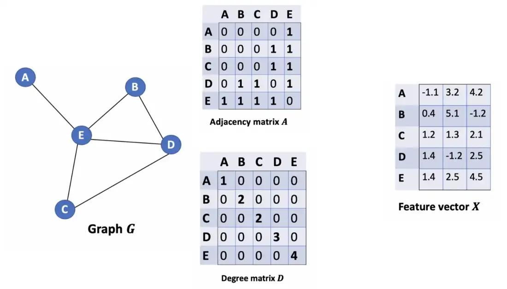

# 图卷积算法
## 为什么要使用图？
自然界中的许多问题都可以建模为关于图结构的问题，我们生活中需要处理的很多问题的数据都是图结构，比如：化学分子的结构，社交网络中人与人之间的关系结构以及论文引用网络等等。

### 在图结构数据上的任务
- 节点分类：预测给定的节点的种类
- 连接预测：预测两个节点是否相连
- 群体检测：识别密集连接的节点集群
- 网络相似检测：判断两个网络的相似度

### 图卷积目的
对于图结构，我们需要有每个节点的特征以及知道这些节点是怎么连接的(图结构怎么表示)。

对于前者来说，我们可以很容易得到，但是对于后者来说，图结构怎么表示呢？从图结构中提取位置信息并不是一件简单的事情。例如，如果两个节点距离很近，那我们应不应该区别对待他们？节点的度如果很高是不是和度很低的节点不一样？所以，要从图结构中提取位置信息是一件很难，并且很好时间精力的事情。

图卷积的出现就是为了解决这一问题，即**更方便高效地提取图结构的位置信息**。

## 图卷积网络(GCN)
### 主要思想
图卷积中的“卷积”二字是来自于卷积神经网络 CNN 中的卷积，只不过输入数据由图片变成了图结构，图结构远远比图片复杂。

**GCN 的总体思想：**对于每一个节点，我们会获取它自己和它的邻居节点的综合特征信息。

假如，使用 average() 函数，我们会把该函数用在所有的节点上，然后把得到的平均值喂到一个神经网络中。

举一个例子，对于下图来说的橘色节点。首先得到邻居节点包括它本身的所有特征信息，然后取平均，得到的结果被输入到神经网络中，最后得到结果。

事实上，我们可以用比 average 函数更复杂的聚集函数，我们也可以堆叠更多的层，来得到一个更深的图神经网络，这一层的输出可以当作下一层的输入。

说完了概念思想，我们来看一下在公式上，GCN 是怎么实现的。

### 数学表示
让我们考虑下面这个图 G：

我们怎么获取一个点的邻居节点的所有特征值呢？

答案就是 $A$ 和 $X$ 相乘。

通过该例可以看出，$AX$矩阵的第一行聚集了 A 节点的所有邻居节点的信息。
同样的第二行聚集了 B 节点的所有邻居节点的信息...
由此得到的矩阵 $AX$ 就聚集了每个点的所有邻居节点的特征信息。
**但是**，这存在一些问题：

1. 我们忽略了节点本身的信息。
2. 我们不是要使用 sum() 函数(因为如果使用 sum 函数，度数高的节点的特征很可能会比度数低的节点更大，而且可能会使 GCN 对神经网络的规模太敏感。)，而是要使用 average, 或者是更好的其他函数，来处理邻居节点的特征信息。

对于问题 1，我们通常选择加上单位矩阵$I$来解决这个问题。
$$
\widetilde{A} = A + \lambda I_N
$$
$\lambda$ 可以是一个可训练的超参数。我们通常把它设置为固定的值 1.

对于问题 2,我们通常会选择使用度矩阵$\widetilde{D}$来做规范化的事(average等)，拿 average 做例子。

我们使用 $\widetilde{D}$ 的逆矩阵，即$\widetilde{D}^{-1}$，来做这件事。

通过$\widetilde{D}$与$X$相乘，我们就可以得到某个节点的所有邻居节点的特征信息(包括它本身)

如果我们把度矩阵和邻接矩阵一起考虑(即$(\widetilde{D}^{(-1)}\widetilde{A})X$，而不是$\widetilde{D}^{(-1)}(\widetilde{A}X)$)，这样看来邻接矩阵$\widetilde{A}$仅仅是每一行被规范化了，而每一列没有被规范化。而邻接矩阵是一个对阵矩阵，所以，直觉告诉我们，我们应该对列也进行规范化操作。

但是这样就使用了两次度矩阵，相当于进行了两次规范化平均，这会导致经过规范化后，特征信息变小，所以我们使用$\widetilde{D}^{-1/2}$

最终的邻接矩阵的表达式为：
$$
\hat{A} = \widetilde{D}^{-1/2} \widetilde{A} \widetilde{D}^{-1/2}
$$
类比于传统卷积 CNN 的公式
$$
f = softmax(XW)
$$
图卷积 GCN 的公式则为
$$
f = softmax(\hat{A}XW)
$$

### 其他
本报告关于图卷积公式是从几何的角度推导的，还有另外一种方式：光谱图卷积，但是公式最终推导出来的结果是相同的，光谱图卷积的推导过程不如几何角度推导好理解，所以本报告选择了介绍几何图卷积的推导方式。

相关参考文献: [Graph Convolution Networks(GCN)](https://medium.com/ai-in-plain-english/graph-convolutional-networks-gcn-baf337d5cb6b)