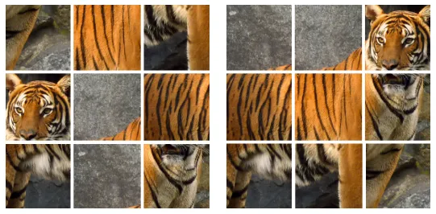
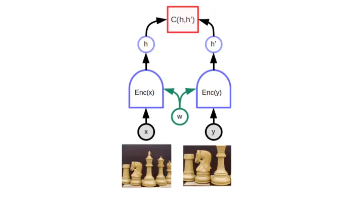
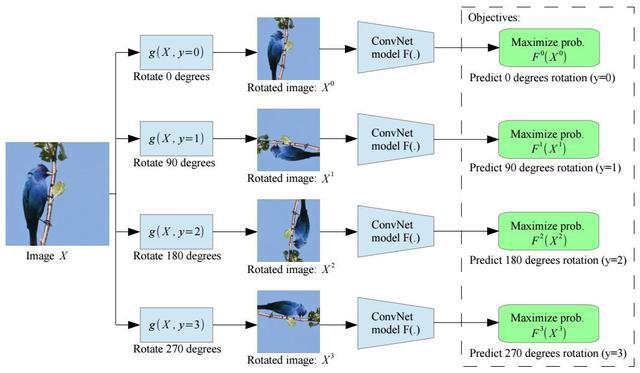
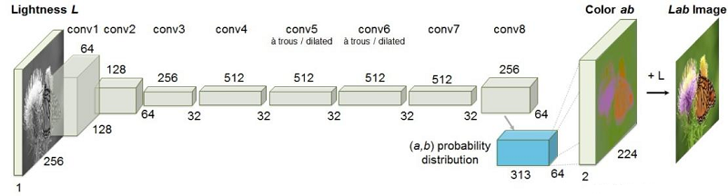
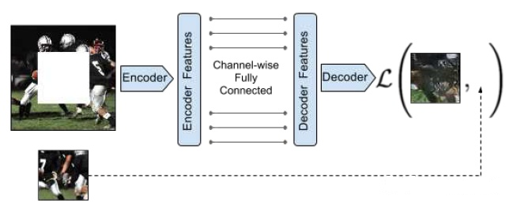
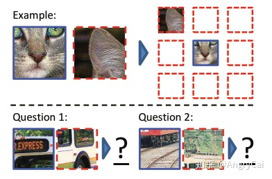
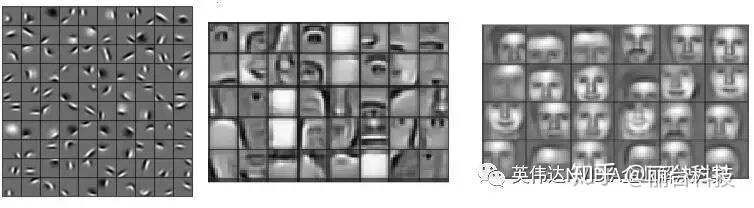

## 自监督
自监督不需要提供人为标注的监督信号，而是直接在提供的数据上构造监督信号。

比如通过拼图的方式构造：

比如通过对比学习的方式构造：

自监督的监督信号来源于数据本身的内容，也就是自己给自己监督信号。

### 自监督的用途
自监督学习通常利用辅助任务(pretext)从大规模的无监督数据中挖掘自身的监督信息，通过构造的监督信息对网络进行预训练，从而学习到对下游任务有价值的表征。

### Pretext Task
自监督的关键在于设计辅助任务 pretext(上面列举的拼图和对比学习就是两种 pretext task)。

Pretext task 可以理解为是一种为达到特定训练任务而设计的间接任务。

比如，要训练一个网络来对 ImageNet 分类，可以表达为 fθ(x):x→y，目的是获得具有语义特征提取推理能力的 θ。假设有另外一个任务 (Pretext task )，可以近似获得 θ。 比如， Auto−encoder(AE
) , 表示为： gθ(x):x→x。为什么 AE 可以近似 θ 呢? 因为 AE 要重建 x 就必须学习 x 中的内在关系，而这种内在关系的学习又是有利于我们学习 fθ(x) 的。这种方式也叫做预训练，为了在目标任务上获得更好的泛化能力，一般还需要进行 fine−tuning 等操作。

因此，Pretex task 的好处就是简化了原任务的求解，在深度学习里就是避免了人工标记样本，实现无监督的语义提取。

Pretext任务可以进一步理解为：对目标任务有帮助的辅助任务。这种任务目前更多用于自监督学习，即一种更加宽泛的无监督学习。以往训练深度学习需要大量的人工标注的样本，这是费时耗力的，而自监督的提出就是为了打破这种人工标注样本的限制，目的是在没有人工标注的条件下也能高效的训练网络，自监督的核心问题是如何产生伪标签（Pseudo label），而这种伪标签的产生是不涉及人工的，比如上述的 AE 的伪标签就是自身。这里举几个在视觉任务里常用的 pretext task 伪标签的产生方式：

Rotation(图片旋转):

Colorization(图片上色)

Inpainting(图片补全)

Jigsaw Puzzle/Context Prediction(关系预测/上下文预测)

## 无监督学习

清晰、完美标记的数据集并不容易获得。有时，研究人员会向算法询问一些他们未知的问题。而这正是无监督式学习可以发挥作用的地方。在无监督式学习中，深度学习模型会收到某个数据集，但对于如何处理该数据集却未获得明确的指示。训练数据集是没有特定预期结果或正确答案的示例的集合。然后，神经网络尝试通过提取有用的特征并分析其结构来自动发现数据结构。

## 二者的区别
自监督是无监督的一个变种，自监督也没有人为标注的监督信号，但是自监督会在提供的数据上自己构造监督信号。以什么方法自己构造监督信号，这是需要人类决定的，这种方法或者说任务被称作 pretext task.