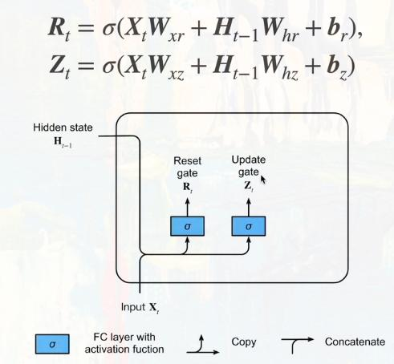
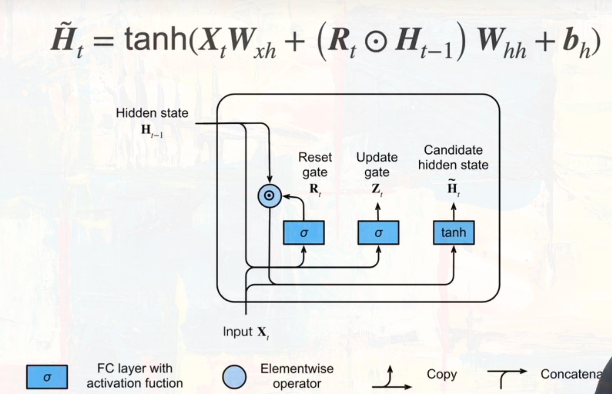
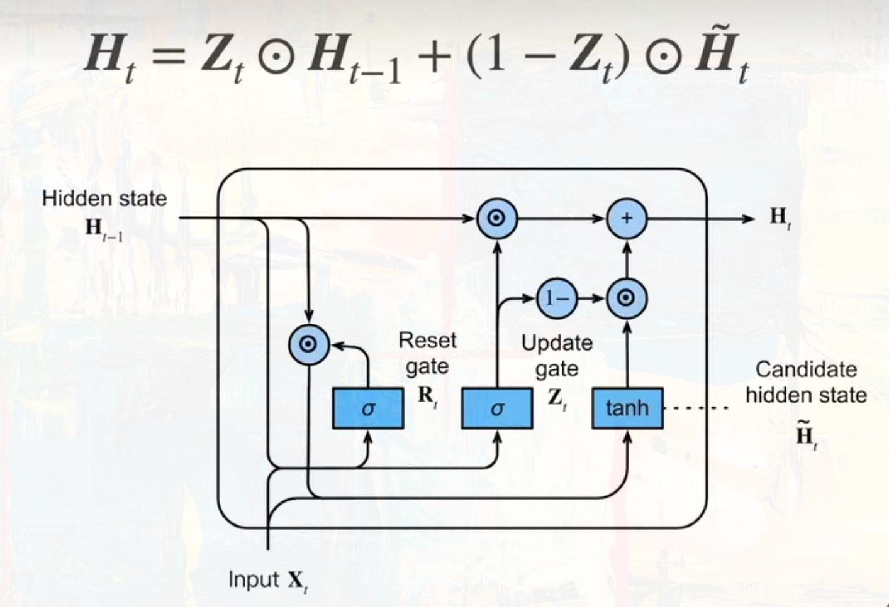
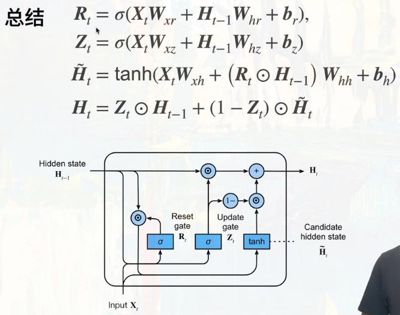

# 门控循环单元(GRU)

> GRU 是一个可以达到和 LSTM 相似效果，但是参数量更少的时序网络。

## 关注一个序列

- 不是每个观察值都是同等重要的
- 想记住相关的观察需要：
  - 能关注的机制(更新门)
  - 能遗忘的机制(重置门)

## 两个门

## 候选隐状态

由于 $R_t$ 经过了 sigmoid 激活函数，所以它是一个 (0, 1) 的张量，如果 $R_t$ 中的某个元素接近于 0 ，则通过 $R_t \odot H_{t-1}$ 选择了 $H_{t-1}$ 中的元素值。

## 隐状态

$Z_t$ 也是一个所有元素均为 (0, 1) 的张量。

在极端情况下，$Z_t$ -> 0 时, $H_t$ 几乎等于当前候选隐状态；$Z_t$ -> 1 时, $H_t$ 几乎等于前一隐状态；

## 总结

通过学习 $Z_t$ 和 $R_t$ 来调节当前输入 $X_t$ 与隐状态 $H_{t-1}$ 之间的权重大小。
